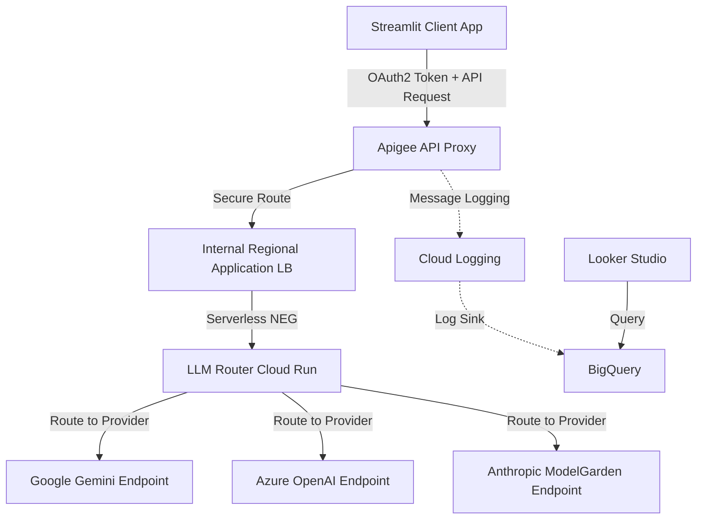
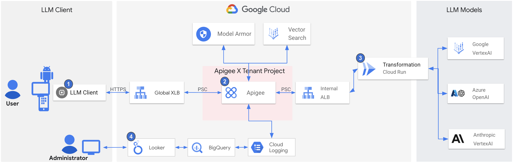
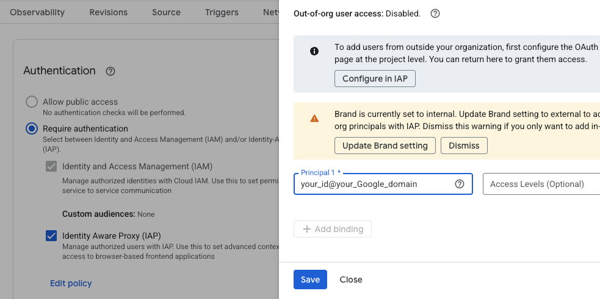

# Apigee LLM Gateway

This repository implements an LLM Gateway solution using Apigee for API management, an Internal Load Balancer, and a custom Router running on Cloud Run.

## Architecture Flow

The overall request flow is as follows:

`Client -> Apigee Proxy -> Internal Load Balancer -> Serverless NEG -> LLM Router (Cloud Run) -> Target LLM Endpoints`

### Diagram



### Architecture


## Deployment Permissions & Roles

To successfully deploy and run all automation scripts (enabling APIs, creating service accounts, assigning IAM roles, provisioning the load balancer, deploying Cloud Run services, and configuring Apigee resources), the deploying user needs a highly privileged set of permissions in the Google Cloud project.

> [!IMPORTANT]
> Because the scripts interact with multiple distinct Google Cloud services (IAM, Compute Engine, Cloud Run, Model Armor, Service Usage, and Apigee), **it is highly recommended that the deploying user has the `Owner` (`roles/owner`) role** on the project, or at least the `Editor` (`roles/editor`) role combined with **`Project IAM Admin` (`roles/resourcemanager.projectIamAdmin`)** and **`Apigee Organization Admin`** roles. *(Note: The basic `Editor` role alone can create service accounts, but does NOT have permission to bind IAM policies/roles to them).*


## Google Cloud Authentication Setup

Before running any deployment or cleanup scripts, you must ensure that your terminal session is correctly authenticated to Google Cloud. Because the scripts interact with both Google Cloud resource management APIs (via `gcloud`) and the Apigee Control Plane (via `apigeecli`), you need to perform **both** of the following interactive authentication steps:

### 1. User Account Authentication (for `gcloud` commands)
This authenticates the `gcloud` CLI to manage standard Google Cloud resources like Cloud Run, Load Balancers, IAM Roles, and Service Accounts.
Run this command and complete the sign-in prompts in your browser:
```bash
gcloud auth login
```

### 2. Application Default Credentials (ADC) Authentication (for `apigeecli` and `curl` commands)
This authorizes local CLI tools and automated deployment scripts (using Google's standard client libraries or direct REST APIs) to authenticate using your active user identity.
Run this command, select your account, and approve the authorization prompts in your browser:
```bash
gcloud auth application-default login
```
The credentials will be saved to your local machine (`~/.config/gcloud/application_default_credentials.json`) and will be automatically used by `apigeecli` and our automated provisioning scripts.

---

## Components and Deployment

Before deploying any of the components below, you must configure your environment variables in [env.sh](file:///usr/local/google/home/cbhong/vscode1/apigee-aigw/env.sh) and load them into your current terminal session.

> [!IMPORTANT]
> **Initial Environment Configuration:**
>
> 1. Open and update [env.sh](file:///usr/local/google/home/cbhong/vscode1/apigee-aigw/env.sh) with your Google Cloud Project ID, Apigee Environment name, and Apigee Host:
>    ```bash
>    export PROJECT="YOUR_GCP_PROJECT_ID"
>    export APIGEE_ENV="YOUR_APIGEE_ENVIRONMENT"
>    export APIGEE_HOST="YOUR_APIGEE_HOST"
>    ```
> 2. Run the following command to export these variables to your active shell session:
>    ```bash
>    source ./env.sh
>    ```

---

### 1. LLM Router (`/apigee-aigw-router`)
A Node.js application that receives requests and routes them to the appropriate LLM provider based on configuration.
*   **Configuration**: Before deploying, you must edit `apigee-aigw-router/eval.properties` to fill in your actual project ID, hostnames, and API keys for the LLM providers.
*   **Deployment**: Run the `deploy_router.sh` script in the root directory.
    ```bash
    ./deploy_router.sh
    ```
    This script deploys the router to Cloud Run with ingress restricted to internal and load balancing traffic. The required service account (`apigee-aigw-router-svc-acct`) and its IAM role bindings will be automatically created during deployment.

### 2. Internal Load Balancer & Serverless NEG
Routes traffic from Apigee to the Cloud Run backend securely within the VPC using an Internal Regional Application Load Balancer and Serverless NEG.
*   **Deployment**: Run the `deploy_lb.sh` script in the root directory.
    ```bash
    ./deploy_lb.sh
    ```
    This script will automatically:
    1.  Discover your VPC network and subnetwork in your configured `REGION`.
    2.  Validate that a **Proxy-Only Subnet** (required for Envoy-based Internal Load Balancers) is present in your VPC/region, failing with clear setup instructions and commands if it is missing.
    3.  Create a **Serverless Network Endpoint Group (NEG)** pointing to your deployed `apigee-aigw-router` Cloud Run service.
    4.  Reserve a static regional internal IP address for the Load Balancer.
    5.  Generate a self-signed SSL certificate with Subject Alternative Names (SAN) for both `primary.[LB_IP].nip.io` and `fallback.[LB_IP].nip.io` and upload it to Google Cloud.
    6.  Configure the URL Map, Target HTTPS Proxy, and Forwarding Rule (exposing the service on port 443 with SSL).
    7.  Print the Load Balancer IP and target hostnames upon completion.
*   **Apigee Target Servers**: You do not need to register the Target Servers manually! They will be automatically provisioned in Apigee under the names `apigee-aigw-primary` and `apigee-aigw-fallback` during the proxy deployment step.

### 3. Model Armor & Prerequisites (`/deploy_prereq.sh`)
Enables required APIs, configures Apigee policies, and sets up the Model Armor template.
*   **Configuration**: Make sure `PROJECT` and `REGION` are configured in [env.sh](file:///usr/local/google/home/cbhong/vscode1/apigee-aigw/env.sh).
*   **Deployment**: Run the `deploy_prereq.sh` script in the root directory.
    ```bash
    ./deploy_prereq.sh
    ```
    This script will:
    1.  Enable the **Model Armor API** in your Google Cloud project.
    2.  Update the region and template reference in Apigee policies (`SUP-MA.xml` and `SMR-MA.xml`) to match your configured `REGION`.
    3.  Create a Model Armor template named `apigee-aigw-template` with standard security filters (jailbreak, hate speech, harassment, sexually explicit, and dangerous content).

### 4. Apigee Proxy (`/apiproxy`)
Manages authentication (OAuth2), quota, and acts as the entry point.
*   **Configuration**: Before deploying, you must edit `apiproxy/targets/default.xml` to modify the `<Audience>` value to match your Cloud Run service's audience (usually the Cloud Run URL).
*   **Deployment**: Run the `deploy_proxy.sh` script in the root directory.
    ```bash
    ./deploy_proxy.sh
    ```
    Ensure you have configured [env.sh](file:///usr/local/google/home/cbhong/vscode1/apigee-aigw/env.sh) first with your project and environment details.
*   **Automated Provisioning**: Before and after the proxy is deployed, `deploy_proxy.sh` will automatically provision the following Apigee resources:
    1.  **Target Servers**: Automatically queries Google Cloud for the reserved internal load balancer IP and creates two Target Servers, `apigee-aigw-primary` and `apigee-aigw-fallback`, with SSL enabled and pointing to the load balancer domains.
    2.  **API Products**: Creates `apigee-aigw-bronze` and `apigee-aigw-gold` using the operation group templates defined in `product-operations-bronze-template.json` and `product-operations-gold-template.json` (dynamically substituting your `PROXY_NAME` at deployment).
    3.  **Developer**: Creates a developer profile for `apigee-aigw-dev@apigee.com`.
    4.  **Developer App**: Creates `apigee-aigw-all-app` subscribed to both the `apigee-aigw-bronze` and `apigee-aigw-gold` products.
    5.  **Credentials**: The script will print the generated **Client ID** (Consumer Key) and **Client Secret** (Consumer Secret) to the terminal. Note these credentials; you will need them in **Step 5** (Client Application configuration).

### 5. Client Application (`/apigee-aigw-client`)
A Streamlit-based web application for demonstrating the LLM Gateway.
*   **Configuration**: Edit the `.env` file in the `apigee-aigw-client` directory and set the following variables with the credentials obtained in Step 4:
    *   `APIGEE_HOSTNAME`: The hostname of your Apigee gateway.
    *   `BASIC_CLIENT_ID`: The Client ID printed by the script (from `apigee-aigw-all-app`).
    *   `BASIC_CLIENT_SECRET`: The Client Secret printed by the script (from `apigee-aigw-all-app`).
    *   `PREMIUM_CLIENT_ID`: (Use the same Client ID as above).
    *   `PREMIUM_CLIENT_SECRET`: (Use the same Client Secret as above).
    *   *Note: Since the automated script creates a single developer app (`apigee-aigw-all-app`) subscribed to both products, the credentials for both tiers are identical.*    
*   **Deployment**: Run `deploy_client.sh` to deploy the client app to Cloud Run.
    1.  After successful deployment, the Cloud Run Service URL will be displayed in the terminal output.
    2.  In the Google Cloud Console, go to the **Cloud Run Services** menu, select the `apigee-aigw-client` service, navigate to the **Security** tab, enable **Identity-Aware Proxy (IAP)**, and add authorized users to the policy.
        *   **Note**: It may take a few minutes for the IAP configuration to take effect after enabling it. Please wait a moment before accessing the UI.
        
    3.  Access the UI by opening the provided Cloud Run Service URL in your browser.

### 6. Logging & Dashboard Setup
Configure log pipeline from Apigee to BigQuery and visualize in Looker Studio.
*   **Logger Verification**: The deployed Apigee proxy uses a Message Logging policy (`apiproxy/policies/ML-cloudLogging.xml`) that writes logs to a log name matching `aigw-multillm-demo`.
*   **Log Pipeline Configuration**:
    1.  **Create BigQuery Dataset**: Create a dataset in BigQuery to store the logs.
    2.  **Create Log Sink**: In Google Cloud Logging, create a Log Sink with the following settings:
        *   **Sink Destination**: BigQuery dataset (select the one created above).
        *   **Inclusion Filter**: `logName:"projects/[PROJECT_ID]/logs/apigee-aigw-logging"` (Replace `[PROJECT_ID]` with your actual project ID).
*   **Dashboard Configuration**:
    1.  Open **Looker Studio** and create a new report.
    2.  Add data using the **BigQuery** connector.
    3.  Select your project, dataset, and the table created by the Log Sink.
    4.  Create charts and tables to visualize metrics such as token usage, response times, and errors based on the fields logged by the Message Logging policy.
*   **Reference Links**:
    *   [Apigee Message Logging Policy Documentation](https://cloud.google.com/apigee/docs/api-platform/reference/policies/message-logging-policy)
    *   [Cloud Logging: Routing and sinking logs](https://cloud.google.com/logging/docs/export/configure_export_v2)
    *   [Looker Studio: Connect to BigQuery](https://cloud.google.com/looker-studio/docs/connector-bigquery)

### 7. Test

You can test the routing, security, quota, and failover mechanisms using the Streamlit client application. Follow the steps below in order to verify the gateway features:

#### 1. Get an Access Token
To authorize your requests and enforce tier-based policies, you must first obtain an OAuth access token:
*   Open the Streamlit client application in your browser.
*   Go to the **Get Token** tab.
*   Select a Group (e.g., `Premium` or `Basic`) and a User, then click the **Get Token** button.
*   Copy the generated access token shown in the green success box.

#### 2. Normal Case (Model Calling, Model Armor, Quota)
Verify that standard API operations, prompt safety checks, and quota limits work as expected under normal operating conditions:
*   **Standard Model Calling**:
    *   Go to the **Demo - Security, Quota, Routing LLMs** tab.
    *   Paste your access token into the **Access Token** field.
    *   Select a Provider (e.g., `Google`) and a Model with a standard setup (e.g., `gemini-2.5-flash` or `gemini-3-flash-preview`).
    *   Enter a prompt and click **Submit**.
    *   **Expected Result**: The request is successfully routed to the primary provider. The response is streamed to the UI, and the responding model is shown at the bottom (e.g., `model = google/gemini-2.5-flash`).
*   **Prompt Safety & Sanitization (Model Armor)**:
    *   Apigee uses Model Armor to inspect and filter prompt requests. If a user submits a prompt containing malicious content, jailbreaks, PII, or unsafe language, Model Armor will block or sanitize the request.
    *   To test, enter a prompt that violates typical safety guidelines or attempts a basic jailbreak.
    *   **Expected Result**: Apigee blocks the request before it reaches the backend, returning a safety violation error message.
*   **Quota Enforcement (Call & Token-based)**:
    *   Use an access token from the **Basic** group (which has lower limits, e.g., 5 requests / 5 minutes).
    *   Repeatedly submit prompts in rapid succession, or submit a very long prompt containing large text blocks.
    *   **Expected Result**: Once the request count or token limit is exceeded, Apigee's Quota policy will block the request and display a warning/error (e.g., `Quota violation` or `Spike arrest limit exceeded`).

#### 3. Failover Case (gemini-3.1-pro-preview, gpt-4.1-mini)
Verify that the gateway automatically detects primary endpoint failures and routes requests to the configured fallback endpoints:
*   **Test Gemini 3.1 Pro Failover**:
    *   In the **Demo** tab, ensure your access token is pasted.
    *   Select Provider: `Google`, and Model: `gemini-3.1-pro-preview`.
    *   Enter a prompt (e.g., "What is LLM Gateway?") and click **Submit**.
    *   **Expected Result**: The primary URL for this model is intentionally configured with `/xxxv1` in `eval.properties` to simulate an endpoint failure. The LLM Router catches the failure and instantly redirects the request to its fallback model: `gpt-4.1-mini` on Azure. The responding model will display: `model = gpt-4.1-mini`.
*   **Test GPT-4.1-Mini Failover**:
    *   Select Provider: `Azure`, and Model: `gpt-4.1-mini`.
    *   Enter a prompt and click **Submit**.
    *   **Expected Result**: The primary URL for this model is intentionally configured with `/xxxopenai` in `eval.properties`. The LLM Router catches the failure and instantly redirects the request to its fallback model: `google/gemini-3-flash-preview` on Vertex AI. The responding model will display: `model = google/gemini-3-flash-preview`.

---

*(Optional) Note: For testing direct API integration outside the UI, you can also use `curl` to send a POST request to `https://[YOUR_APIGEE_HOSTNAME]/v1/llm-gw-cr/route/chat/completions` with the header `x-accesstoken: [ACCESS_TOKEN]`.*

### 8. Clean Up (Undeploy)

If you want to delete all resources created during this deployment, run the `undeploy_all.sh` script in the root directory:
```bash
./undeploy_all.sh
```
This script will automatically:
1. **Undeploy and Delete the Apigee Proxy**: Removes the proxy bundle `$PROXY_NAME` from your Apigee environment and organization.
2. **Undeploy and Delete the Internal Load Balancer & Serverless NEG**: Removes the forwarding rule, target HTTPS proxy, URL map, SSL certificate, backend service, serverless NEG, and reserved internal IP address.
3. **Delete the Model Armor Template**: Deletes the `apigee-aigw-template` from your project and region.
4. **Delete Cloud Run Services**: Deletes the `apigee-aigw-router` and `apigee-aigw-client` services.
5. **Delete Service Accounts**: Deletes the `apigee-aigw-router-svc-acct`, `apigee-aigw-proxy-svc-acct`, and `apigee-aigw-client-svc-acct` service accounts.

*Note: You must manually delete the BigQuery dataset and Cloud Logging Log Sink if you no longer need them.*
